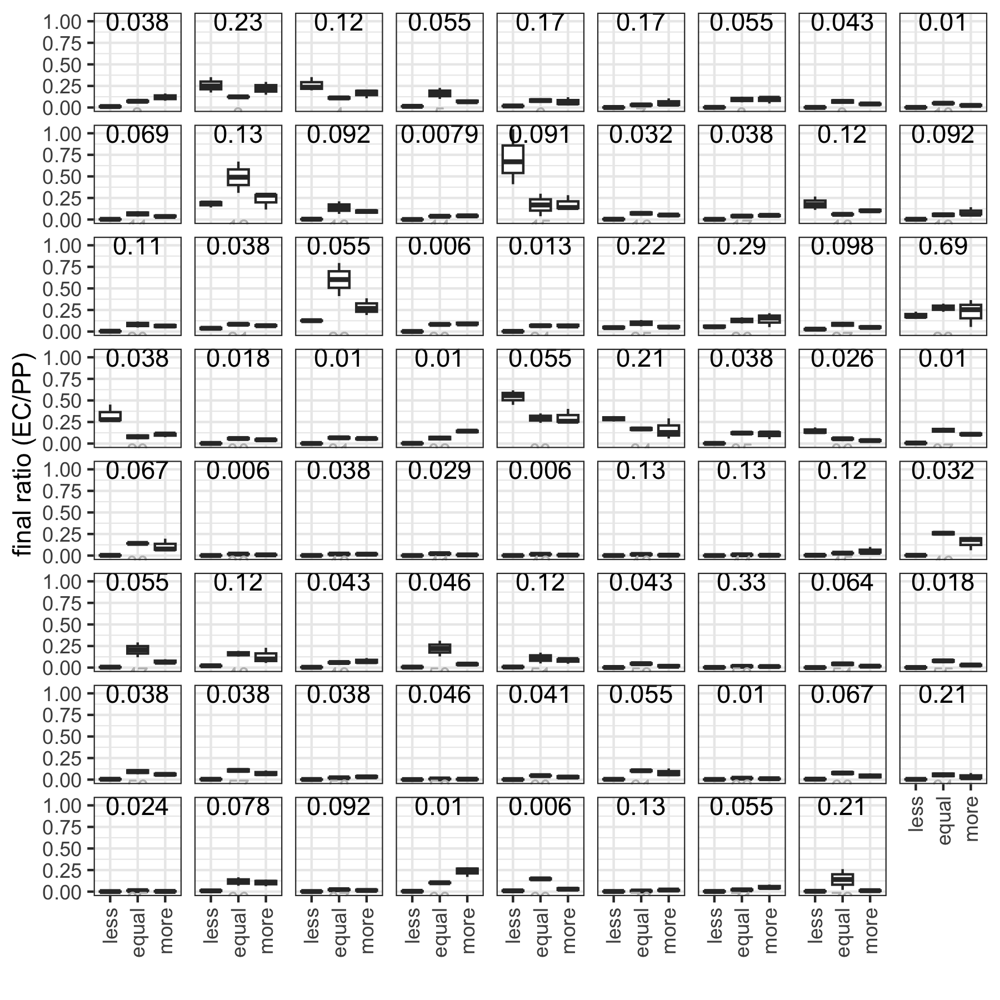
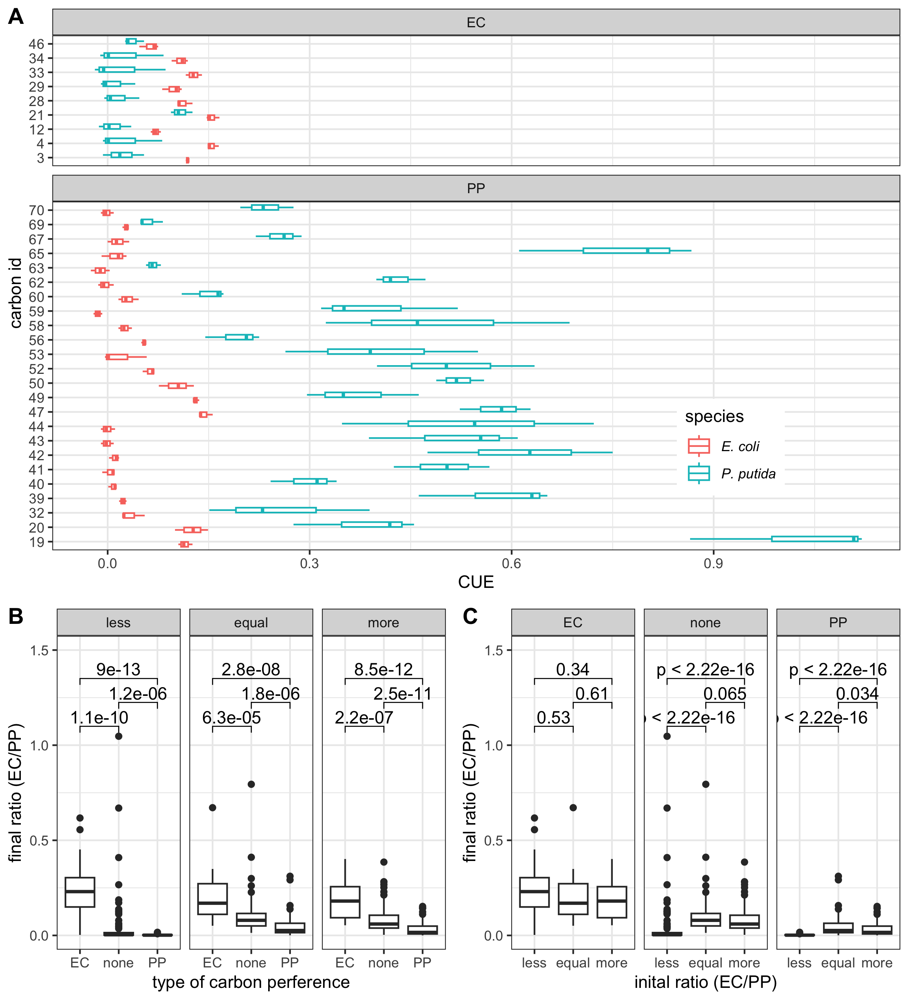
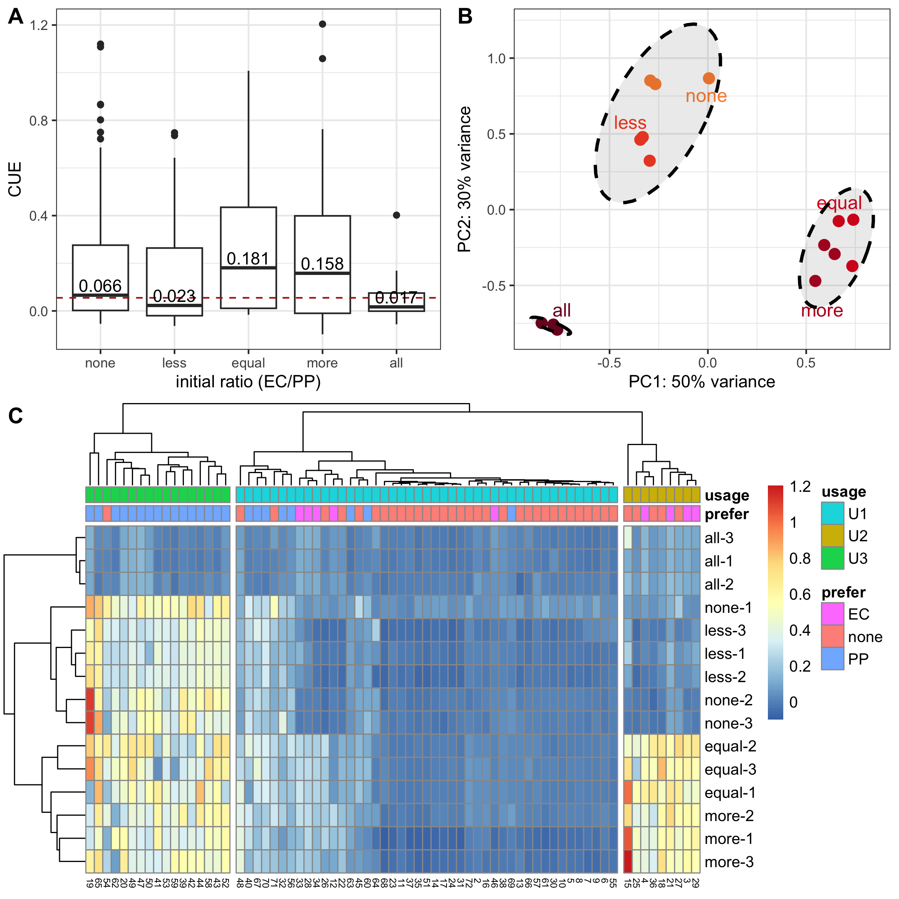
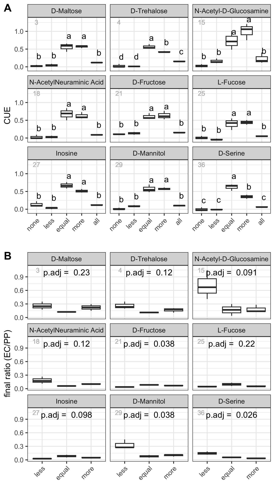
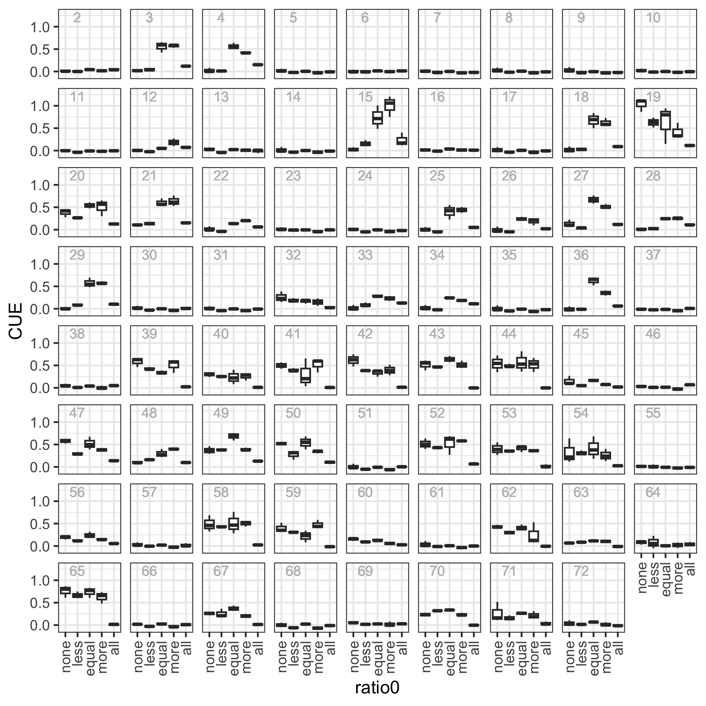
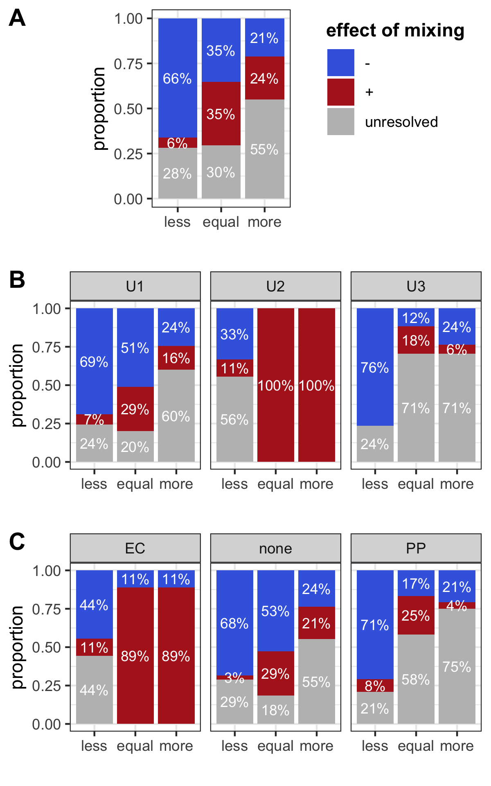

load packages
=============

``` r
library(tidyverse)
library(cowplot)
library(ggpubr)
library(pheatmap)
library(RColorBrewer)
library(vegan)

theme_set(theme_bw())
```

To enable reproducible study, we provided the raw-data and source codes
for analysis and generating figures. Figures 1-6 and Figures S2-S4 were
generated by the following R codes.

Raw data
========

Raw data were stored in the `data` folder. It mainly comes from two
experiments: one is the BIOLOG standard assay with eco-plate, and the
other is the species-specific qPCR assasy. The raw data is provided as
in formatted form.

``` r
biolog_24h <- read_csv("data/biolog.csv")
qPCR_data <- read_csv(file="data/qPCR.csv")
head(biolog_24h)
#> # A tibble: 6 x 5
#>   ratio0 plate carbon_id  A590  A750
#>   <chr>  <dbl>     <dbl> <dbl> <dbl>
#> 1 equal      1         1 0.191 0.138
#> 2 equal      1         2 0.344 0.181
#> 3 equal      1         3 1.37  0.561
#> 4 equal      1         4 1.25  0.778
#> 5 equal      1         5 0.191 0.137
#> 6 equal      1         6 0.259 0.142
head(qPCR_data)
#> # A tibble: 6 x 6
#>   ratio0 plate carbon_id         EC         PP   ratio1
#>   <chr>  <dbl>     <dbl>      <dbl>      <dbl>    <dbl>
#> 1 less       1        10    177416. 175245243. 0.00101 
#> 2 less       1        11    239521. 148368132. 0.00161 
#> 3 less       1        12  29837437. 142288704. 0.210   
#> 4 less       1        13    645563. 162324668. 0.00398 
#> 5 less       1        14     52481. 142197847. 0.000369
#> 6 less       1        15 164023932. 156667034. 1.05
```

The columns are:

-   `ratio0`: initial ratio, indicating the name of cultures. “none”,
    “less”, “equal”, “more”, “all” represent the *P. putida*
    monoculture, 1:1000 (EC/PP, same below), 1:1, 1000:1 cocultrues and
    and *E. coli* monoculture, respectively.
-   `plate`: experiment replicates.
-   `A590`: the absorbtance in 590 nm, as reported by BIOLOG
    workstation.
-   `A750`: the absorbtance in 750 nm, as reported by BIOLOG
    workstation, a measurment of carbon usage efficiency in this study.
-   `carbon_id`: the id of carbon sources. From 1-72, in which 1 is the
    negative control. The following variable `carbon_name` shows the
    name of each carbon sources.
-   `EC`: the quantity of *E. coli* in coculture
-   `PP`: the quantity of *P. putida* in coculture

``` r
carbon_name <- read_csv("data/carbon.csv")
head(carbon_name)
#> # A tibble: 6 x 2
#>   carbon_id carbon_source
#>       <dbl> <chr>        
#> 1         2 Dextrin      
#> 2         3 D-Maltose    
#> 3         4 D-Trehalose  
#> 4         5 D-Cellobiose 
#> 5         6 Gentiobiosse 
#> 6         7 Sucrose
```

Normalization
-------------

`A750` was normalized by substrating the value of negative control in
each plate.

``` r
qPCR_data <- qPCR_data %>%
   mutate(ratio0 = factor(ratio0, levels = c("less","equal","more")))

# Normalization
biolog_24h <- biolog_24h %>% 
  mutate(ratio0 = factor(ratio0, levels = c("none","less","equal","more","all"))) %>%
  group_by(plate,ratio0) %>% 
  mutate(A590=A590-A590[carbon_id==1],A750=A750-A750[carbon_id==1]) %>% 
  filter(carbon_id!=1) %>%
  ungroup()
biolog_mono_24h <- biolog_24h %>% 
  filter(ratio0 %in% c("none","all")) %>% 
  mutate(species=factor(ratio0,levels = c("all","none"),labels = c("E. coli","P. putida"))) %>% 
  select(-ratio0)
biolog_coculture_24h <- biolog_24h %>% 
  filter(ratio0 %in% c("less","equal","more")) %>%
  mutate(ratio0 = factor(ratio0, levels = c("less","equal","more")))
```

Clustering of carbon sources
----------------------------

Carbon sources were clustered by the `A750` in all the cultures.

``` r
M_A750_24h <- biolog_24h %>% mutate(sample=paste(ratio0,plate,sep="-")) %>%
  select(sample,carbon_id,A750) %>%
  spread(key=sample,value=A750) %>%
  as.data.frame() %>%
  tibble::column_to_rownames(var="carbon_id")
k3 <- cutree(hclust(dist(M_A750_24h)),k=3)
carbon_group <-  data.frame(usage=k3) %>%
  rownames_to_column(var="carbon_id") %>%
  mutate(carbon_id=as.numeric(carbon_id)) %>%
  mutate(usage=paste("U",usage,sep=""))
```

Defining the carbon preference
------------------------------

Carbon preferences were determined by comparing the `A750` values
between *E. coli* and *P.putida* monocultures.

``` r
biolog_mono_A750_24h <- biolog_mono_24h %>% 
  select(plate,carbon_id,species,A750) %>% 
  spread(species,A750) 

PP_prefered <- biolog_mono_A750_24h %>% 
  group_by(carbon_id) %>%  
  summarise(p=t.test(`P. putida`,`E. coli`,alternative = "greater")$p.value) %>% 
  filter(p<0.05)
EC_prefered <- biolog_mono_A750_24h %>% 
  group_by(carbon_id) %>%  
  summarise(p=t.test(`P. putida`,`E. coli`,alternative = "less")$p.value) %>% 
  filter(p<0.05)

carbon_prefer <- data.frame("carbon_id"=carbon_name$carbon_id,
                            "prefer"="none",
                            stringsAsFactors = F)
carbon_prefer[carbon_prefer$carbon_id %in% EC_prefered$carbon_id,"prefer"] <- "EC"
carbon_prefer[carbon_prefer$carbon_id %in% PP_prefered$carbon_id,"prefer"] <- "PP"
```

Figure 1. The model
===================


Table 1 The list of 71 carbon sources used in this study
========================================================

``` r
library(kableExtra)
left_join(carbon_name,carbon_group) %>% 
  left_join(carbon_prefer) %>% 
  kable()
```

<table>
<thead>
<tr>
<th style="text-align:right;">
carbon\_id
</th>
<th style="text-align:left;">
carbon\_source
</th>
<th style="text-align:left;">
usage
</th>
<th style="text-align:left;">
prefer
</th>
</tr>
</thead>
<tbody>
<tr>
<td style="text-align:right;">
2
</td>
<td style="text-align:left;">
Dextrin
</td>
<td style="text-align:left;">
U1
</td>
<td style="text-align:left;">
none
</td>
</tr>
<tr>
<td style="text-align:right;">
3
</td>
<td style="text-align:left;">
D-Maltose
</td>
<td style="text-align:left;">
U2
</td>
<td style="text-align:left;">
EC
</td>
</tr>
<tr>
<td style="text-align:right;">
4
</td>
<td style="text-align:left;">
D-Trehalose
</td>
<td style="text-align:left;">
U2
</td>
<td style="text-align:left;">
EC
</td>
</tr>
<tr>
<td style="text-align:right;">
5
</td>
<td style="text-align:left;">
D-Cellobiose
</td>
<td style="text-align:left;">
U1
</td>
<td style="text-align:left;">
none
</td>
</tr>
<tr>
<td style="text-align:right;">
6
</td>
<td style="text-align:left;">
Gentiobiosse
</td>
<td style="text-align:left;">
U1
</td>
<td style="text-align:left;">
none
</td>
</tr>
<tr>
<td style="text-align:right;">
7
</td>
<td style="text-align:left;">
Sucrose
</td>
<td style="text-align:left;">
U1
</td>
<td style="text-align:left;">
none
</td>
</tr>
<tr>
<td style="text-align:right;">
8
</td>
<td style="text-align:left;">
D-Turanose
</td>
<td style="text-align:left;">
U1
</td>
<td style="text-align:left;">
none
</td>
</tr>
<tr>
<td style="text-align:right;">
9
</td>
<td style="text-align:left;">
Stachyose
</td>
<td style="text-align:left;">
U1
</td>
<td style="text-align:left;">
none
</td>
</tr>
<tr>
<td style="text-align:right;">
10
</td>
<td style="text-align:left;">
D-Raffinose
</td>
<td style="text-align:left;">
U1
</td>
<td style="text-align:left;">
none
</td>
</tr>
<tr>
<td style="text-align:right;">
11
</td>
<td style="text-align:left;">
α-D-Lactose
</td>
<td style="text-align:left;">
U1
</td>
<td style="text-align:left;">
none
</td>
</tr>
<tr>
<td style="text-align:right;">
12
</td>
<td style="text-align:left;">
D-Melibiose
</td>
<td style="text-align:left;">
U1
</td>
<td style="text-align:left;">
EC
</td>
</tr>
<tr>
<td style="text-align:right;">
13
</td>
<td style="text-align:left;">
β-Methyl-D-Glucoside
</td>
<td style="text-align:left;">
U1
</td>
<td style="text-align:left;">
none
</td>
</tr>
<tr>
<td style="text-align:right;">
14
</td>
<td style="text-align:left;">
D-Salicin
</td>
<td style="text-align:left;">
U1
</td>
<td style="text-align:left;">
none
</td>
</tr>
<tr>
<td style="text-align:right;">
15
</td>
<td style="text-align:left;">
N-Acetyl-D-Glucosamine
</td>
<td style="text-align:left;">
U2
</td>
<td style="text-align:left;">
none
</td>
</tr>
<tr>
<td style="text-align:right;">
16
</td>
<td style="text-align:left;">
N-Acetyl-β-Dmannosamine
</td>
<td style="text-align:left;">
U1
</td>
<td style="text-align:left;">
none
</td>
</tr>
<tr>
<td style="text-align:right;">
17
</td>
<td style="text-align:left;">
N-Acetyl-D-Galactosamine
</td>
<td style="text-align:left;">
U1
</td>
<td style="text-align:left;">
none
</td>
</tr>
<tr>
<td style="text-align:right;">
18
</td>
<td style="text-align:left;">
N-AcetylNeuraminic Acid
</td>
<td style="text-align:left;">
U2
</td>
<td style="text-align:left;">
none
</td>
</tr>
<tr>
<td style="text-align:right;">
19
</td>
<td style="text-align:left;">
α-D-Glucose
</td>
<td style="text-align:left;">
U3
</td>
<td style="text-align:left;">
PP
</td>
</tr>
<tr>
<td style="text-align:right;">
20
</td>
<td style="text-align:left;">
D-Mannose
</td>
<td style="text-align:left;">
U3
</td>
<td style="text-align:left;">
PP
</td>
</tr>
<tr>
<td style="text-align:right;">
21
</td>
<td style="text-align:left;">
D-Fructose
</td>
<td style="text-align:left;">
U2
</td>
<td style="text-align:left;">
EC
</td>
</tr>
<tr>
<td style="text-align:right;">
22
</td>
<td style="text-align:left;">
D-Galactose
</td>
<td style="text-align:left;">
U1
</td>
<td style="text-align:left;">
none
</td>
</tr>
<tr>
<td style="text-align:right;">
23
</td>
<td style="text-align:left;">
3-MethylGlucose
</td>
<td style="text-align:left;">
U1
</td>
<td style="text-align:left;">
none
</td>
</tr>
<tr>
<td style="text-align:right;">
24
</td>
<td style="text-align:left;">
D-Fucose
</td>
<td style="text-align:left;">
U1
</td>
<td style="text-align:left;">
none
</td>
</tr>
<tr>
<td style="text-align:right;">
25
</td>
<td style="text-align:left;">
L-Fucose
</td>
<td style="text-align:left;">
U2
</td>
<td style="text-align:left;">
none
</td>
</tr>
<tr>
<td style="text-align:right;">
26
</td>
<td style="text-align:left;">
L-Rhamnose
</td>
<td style="text-align:left;">
U1
</td>
<td style="text-align:left;">
none
</td>
</tr>
<tr>
<td style="text-align:right;">
27
</td>
<td style="text-align:left;">
Inosine
</td>
<td style="text-align:left;">
U2
</td>
<td style="text-align:left;">
none
</td>
</tr>
<tr>
<td style="text-align:right;">
28
</td>
<td style="text-align:left;">
D-Sorbitol
</td>
<td style="text-align:left;">
U1
</td>
<td style="text-align:left;">
EC
</td>
</tr>
<tr>
<td style="text-align:right;">
29
</td>
<td style="text-align:left;">
D-Mannitol
</td>
<td style="text-align:left;">
U2
</td>
<td style="text-align:left;">
EC
</td>
</tr>
<tr>
<td style="text-align:right;">
30
</td>
<td style="text-align:left;">
D-Arabitol
</td>
<td style="text-align:left;">
U1
</td>
<td style="text-align:left;">
none
</td>
</tr>
<tr>
<td style="text-align:right;">
31
</td>
<td style="text-align:left;">
myo-Inositol
</td>
<td style="text-align:left;">
U1
</td>
<td style="text-align:left;">
none
</td>
</tr>
<tr>
<td style="text-align:right;">
32
</td>
<td style="text-align:left;">
Glycerol
</td>
<td style="text-align:left;">
U1
</td>
<td style="text-align:left;">
PP
</td>
</tr>
<tr>
<td style="text-align:right;">
33
</td>
<td style="text-align:left;">
D-Glucose-6-PO4
</td>
<td style="text-align:left;">
U1
</td>
<td style="text-align:left;">
EC
</td>
</tr>
<tr>
<td style="text-align:right;">
34
</td>
<td style="text-align:left;">
D-Fructose-6-PO4
</td>
<td style="text-align:left;">
U1
</td>
<td style="text-align:left;">
EC
</td>
</tr>
<tr>
<td style="text-align:right;">
35
</td>
<td style="text-align:left;">
D-Aspartic Acid
</td>
<td style="text-align:left;">
U1
</td>
<td style="text-align:left;">
none
</td>
</tr>
<tr>
<td style="text-align:right;">
36
</td>
<td style="text-align:left;">
D-Serine
</td>
<td style="text-align:left;">
U2
</td>
<td style="text-align:left;">
none
</td>
</tr>
<tr>
<td style="text-align:right;">
37
</td>
<td style="text-align:left;">
Gelatin
</td>
<td style="text-align:left;">
U1
</td>
<td style="text-align:left;">
none
</td>
</tr>
<tr>
<td style="text-align:right;">
38
</td>
<td style="text-align:left;">
Glycyl-L-Prolin
</td>
<td style="text-align:left;">
U1
</td>
<td style="text-align:left;">
none
</td>
</tr>
<tr>
<td style="text-align:right;">
39
</td>
<td style="text-align:left;">
L-Alanine
</td>
<td style="text-align:left;">
U3
</td>
<td style="text-align:left;">
PP
</td>
</tr>
<tr>
<td style="text-align:right;">
40
</td>
<td style="text-align:left;">
L-Arginine
</td>
<td style="text-align:left;">
U1
</td>
<td style="text-align:left;">
PP
</td>
</tr>
<tr>
<td style="text-align:right;">
41
</td>
<td style="text-align:left;">
L-Aspartic Acid
</td>
<td style="text-align:left;">
U3
</td>
<td style="text-align:left;">
PP
</td>
</tr>
<tr>
<td style="text-align:right;">
42
</td>
<td style="text-align:left;">
L-Glutamic
</td>
<td style="text-align:left;">
U3
</td>
<td style="text-align:left;">
PP
</td>
</tr>
<tr>
<td style="text-align:right;">
43
</td>
<td style="text-align:left;">
L-Histidine
</td>
<td style="text-align:left;">
U3
</td>
<td style="text-align:left;">
PP
</td>
</tr>
<tr>
<td style="text-align:right;">
44
</td>
<td style="text-align:left;">
L-Pyroglutamic
</td>
<td style="text-align:left;">
U3
</td>
<td style="text-align:left;">
PP
</td>
</tr>
<tr>
<td style="text-align:right;">
45
</td>
<td style="text-align:left;">
L-Serine
</td>
<td style="text-align:left;">
U1
</td>
<td style="text-align:left;">
none
</td>
</tr>
<tr>
<td style="text-align:right;">
46
</td>
<td style="text-align:left;">
Pectin
</td>
<td style="text-align:left;">
U1
</td>
<td style="text-align:left;">
EC
</td>
</tr>
<tr>
<td style="text-align:right;">
47
</td>
<td style="text-align:left;">
D-Galacturonic Acid
</td>
<td style="text-align:left;">
U3
</td>
<td style="text-align:left;">
PP
</td>
</tr>
<tr>
<td style="text-align:right;">
48
</td>
<td style="text-align:left;">
L-Galactonic Acid Lactone
</td>
<td style="text-align:left;">
U1
</td>
<td style="text-align:left;">
none
</td>
</tr>
<tr>
<td style="text-align:right;">
49
</td>
<td style="text-align:left;">
D-Gluconic
</td>
<td style="text-align:left;">
U3
</td>
<td style="text-align:left;">
PP
</td>
</tr>
<tr>
<td style="text-align:right;">
50
</td>
<td style="text-align:left;">
D-Glucuronic
</td>
<td style="text-align:left;">
U3
</td>
<td style="text-align:left;">
PP
</td>
</tr>
<tr>
<td style="text-align:right;">
51
</td>
<td style="text-align:left;">
Glucuronamid
</td>
<td style="text-align:left;">
U1
</td>
<td style="text-align:left;">
none
</td>
</tr>
<tr>
<td style="text-align:right;">
52
</td>
<td style="text-align:left;">
Mucic Acid
</td>
<td style="text-align:left;">
U3
</td>
<td style="text-align:left;">
PP
</td>
</tr>
<tr>
<td style="text-align:right;">
53
</td>
<td style="text-align:left;">
Quinic Acid
</td>
<td style="text-align:left;">
U3
</td>
<td style="text-align:left;">
PP
</td>
</tr>
<tr>
<td style="text-align:right;">
54
</td>
<td style="text-align:left;">
D-Saccharic
</td>
<td style="text-align:left;">
U3
</td>
<td style="text-align:left;">
none
</td>
</tr>
<tr>
<td style="text-align:right;">
55
</td>
<td style="text-align:left;">
p-Hydroxy-Phenylacetic Acid
</td>
<td style="text-align:left;">
U1
</td>
<td style="text-align:left;">
none
</td>
</tr>
<tr>
<td style="text-align:right;">
56
</td>
<td style="text-align:left;">
Methyl Pyruvate
</td>
<td style="text-align:left;">
U1
</td>
<td style="text-align:left;">
PP
</td>
</tr>
<tr>
<td style="text-align:right;">
57
</td>
<td style="text-align:left;">
D-Lactic Acid Methyl Ester
</td>
<td style="text-align:left;">
U1
</td>
<td style="text-align:left;">
none
</td>
</tr>
<tr>
<td style="text-align:right;">
58
</td>
<td style="text-align:left;">
L-Lactic Acid
</td>
<td style="text-align:left;">
U3
</td>
<td style="text-align:left;">
PP
</td>
</tr>
<tr>
<td style="text-align:right;">
59
</td>
<td style="text-align:left;">
Citric Acid
</td>
<td style="text-align:left;">
U3
</td>
<td style="text-align:left;">
PP
</td>
</tr>
<tr>
<td style="text-align:right;">
60
</td>
<td style="text-align:left;">
α-Keto-Glutaric Acid
</td>
<td style="text-align:left;">
U1
</td>
<td style="text-align:left;">
PP
</td>
</tr>
<tr>
<td style="text-align:right;">
61
</td>
<td style="text-align:left;">
D-Malic Acid
</td>
<td style="text-align:left;">
U1
</td>
<td style="text-align:left;">
none
</td>
</tr>
<tr>
<td style="text-align:right;">
62
</td>
<td style="text-align:left;">
L-Malic Acid
</td>
<td style="text-align:left;">
U3
</td>
<td style="text-align:left;">
PP
</td>
</tr>
<tr>
<td style="text-align:right;">
63
</td>
<td style="text-align:left;">
Bromo-Succinic
</td>
<td style="text-align:left;">
U1
</td>
<td style="text-align:left;">
PP
</td>
</tr>
<tr>
<td style="text-align:right;">
64
</td>
<td style="text-align:left;">
Tween 40
</td>
<td style="text-align:left;">
U1
</td>
<td style="text-align:left;">
none
</td>
</tr>
<tr>
<td style="text-align:right;">
65
</td>
<td style="text-align:left;">
y-Amino-ButryricAcid
</td>
<td style="text-align:left;">
U3
</td>
<td style="text-align:left;">
PP
</td>
</tr>
<tr>
<td style="text-align:right;">
66
</td>
<td style="text-align:left;">
α-Hydroxy-ButyricAcid
</td>
<td style="text-align:left;">
U1
</td>
<td style="text-align:left;">
none
</td>
</tr>
<tr>
<td style="text-align:right;">
67
</td>
<td style="text-align:left;">
β-Hydroxy-D,L-ButyricAcid
</td>
<td style="text-align:left;">
U1
</td>
<td style="text-align:left;">
PP
</td>
</tr>
<tr>
<td style="text-align:right;">
68
</td>
<td style="text-align:left;">
α-Keto-ButyricAcid
</td>
<td style="text-align:left;">
U1
</td>
<td style="text-align:left;">
none
</td>
</tr>
<tr>
<td style="text-align:right;">
69
</td>
<td style="text-align:left;">
Acetoacetic Acid
</td>
<td style="text-align:left;">
U1
</td>
<td style="text-align:left;">
PP
</td>
</tr>
<tr>
<td style="text-align:right;">
70
</td>
<td style="text-align:left;">
Propionic Acid
</td>
<td style="text-align:left;">
U1
</td>
<td style="text-align:left;">
PP
</td>
</tr>
<tr>
<td style="text-align:right;">
71
</td>
<td style="text-align:left;">
Acetic Acid
</td>
<td style="text-align:left;">
U1
</td>
<td style="text-align:left;">
none
</td>
</tr>
<tr>
<td style="text-align:right;">
72
</td>
<td style="text-align:left;">
Formic Acid
</td>
<td style="text-align:left;">
U1
</td>
<td style="text-align:left;">
none
</td>
</tr>
</tbody>
</table>

Figure 2 Final ratios of cocultures
===================================

Figure 2. Final ratios of cocultures. Examples for significant results
(A) or non-significant results (B) of final ratios. (C) density of
adjusted p-value (ANOVA). inset: barplot shows the frequency of
significance of adjusted p-value (\*\*, p\<0.01, \*, p\<0.05, ns,
p≥0.05). vertical line indicates the position of p-value cutoff.

``` r
aov_p <- compare_means(ratio1~ratio0,
                       group.by = "carbon_id",
                       data=qPCR_data,
                       method = "anova",
                       p.adjust.method = "BH") %>% 
  arrange(p.adj)
```

Figure 2A, B
------------

``` r

carbon_name_labeller <- function(x){
  name_of <- carbon_name$carbon_source
  names(name_of) <- carbon_name$carbon_id
  return(as.character(name_of[x]))
}
selected_significant_carbon_id <- c(29,32,36,39,46)
selected_nonsignificant_carbon_id <- c(3,4,7,19,45)
p1 <- ggplot(
  data=filter(qPCR_data,carbon_id %in% selected_significant_carbon_id) %>%
    left_join(aov_p), 
  mapping = aes(ratio0,ratio1)) 
p2 <- ggplot(
  data=filter(qPCR_data,carbon_id %in% selected_nonsignificant_carbon_id) %>%
    left_join(aov_p),
  mapping = aes(ratio0,ratio1)) 

plots <- lapply(list(p1,p2),function(x){
  x + geom_boxplot() + geom_jitter() +
    geom_text(aes(x="equal", y=0.55,label= paste("p.adj = ",p.adj)),check_overlap = T) +
    geom_text(aes(x="less",y=.65,label=carbon_id),color="grey",size=3) +
    facet_wrap(~carbon_id,
               ncol=5,
               labeller = labeller(carbon_id=carbon_name_labeller)) + 
    # stat_compare_means(method="aov") +
    labs(x="",y="final ratio (EC/PP)")
})


plot_grid(plotlist = plots,ncol=1,labels="AUTO")
```


Figure 2C
---------

``` r
p.cutoff <- 0.05
p1 <- ggplot(aov_p,aes(p.adj)) + 
  # geom_histogram(bins=30) + 
  geom_line(stat = "density",lwd=1) +
  geom_density(lwd=0,color=NA,fill="lightblue") +
  geom_vline(xintercept = p.cutoff,lwd=1,lty="dashed",color="firebrick") +
  geom_text(x=0.06,y=0,label=p.cutoff,
            vjust="top",
            hjust="left",
            color="firebrick")

aov_p$p.adj.signif <- cut(aov_p$p.adj,breaks = c(0,0.01,0.05,1),labels = c("**","*","ns"))
freq <- as.data.frame(table(aov_p$p.adj.signif))
p2 <- ggplot(freq,aes(Var1,Freq)) + geom_col() + 
  labs(x="significance of p.adj",y="frequency") + 
  geom_text(aes(label=Freq),vjust=0,nudge_y = 1) +
  ylim(c(0,50))

library(grid)
vp <- viewport(width=0.4,height=0.6,x=0.7,y=0.6)
pushViewport(vp)
```


``` r
p1
print(p2,vp=vp)
```


Figure S2. Final ratios of all cultures
=======================================

The whole picture of Figure 2A/B.

``` r
ggplot(qPCR_data,aes(ratio0,ratio1)) + geom_boxplot() +
  geom_text(aes(x="equal",y=.001,label=carbon_id),color="grey",vjust=1,size=3,show.legend = F) +
  # ggpubr::stat_compare_means(method="aov",label="p.signif") +
  facet_wrap(~carbon_id) +
  # geom_jitter() +
  geom_text(aes(x="equal", y=1,label= p.adj),check_overlap = T, data=aov_p) +
  # scale_y_log10(breaks=c(0.001,0.01,0.1,1,10),labels=c("0.001","0.01","0.1","1","10")) +
  xlab("") + ylab("final ratio (EC/PP)") +
  theme(axis.text.x = element_text(angle = 90,hjust = 1,vjust = 0.5),
      legend.position = "top",
      legend.direction = "horizontal",
      strip.background = element_blank(),  # remove facet label - "strip"
      strip.text = element_blank())
```



Figure 3. carbon preferences
============================

Figure 3 carbon preferences. (A) definition of E. coli preferred (EC)
and P. putida preferred (PP) carbon sources. x-axis is the CUE and
y-axis is the id of carbon sources. (B) comparison of the final ratios
of a coculture in different type of carbon sources defined by
preference. left: the “less” coculture; middle, the “equal” coculture;
right: the “more” coculture. (C) comparison of the final ratios between
three cocultures in a given type of carbon sources. left: in *E. coli*
preferred carbon sources (EC); middle: in non-preferred carbon sources
(none); right: in *P. putida* preferred carbon sources (PP). The
p-values given on the top of bracket in B and C are calculated by
pairwise Wilcoxon rank sum test.

``` r
p <- left_join(biolog_mono_24h,carbon_prefer) %>% 
  filter(prefer!="none") %>%
  ggplot(aes(factor(carbon_id),A750,color=species)) + 
  geom_boxplot() + 
  facet_wrap(~prefer,scales="free_y",ncol=1) +
  labs(y="CUE",x="carbon id")+
  coord_flip() +
  theme(legend.position = c(0.8,0.2),
        legend.text = element_text(face = "italic"))

library(grid)
library(gtable)

# adjust panel height
gp <- ggplotGrob(p)
# gtable_show_layout(gp)
facet.rows <- gp$layout$t[grepl("panel",gp$layout$name)]
y.var <- sapply(ggplot_build(p)$layout$panel_scales_x,
                function(l) length(l$range$range))
gp$heights[facet.rows] <- gp$heights[facet.rows] * y.var
```

``` r
p1 <- left_join(qPCR_data,carbon_prefer) %>% ggplot(aes(x=prefer,y=ratio1)) + 
  geom_boxplot() + 
  facet_wrap(~ratio0) + 
  stat_compare_means(method="wilcox.test",comparisons = list(c("EC","none"),c("none","PP"),c("EC","PP"))) +
  labs(x="type of carbon perference", y="final ratio (EC/PP)") +
  ylim(c(NA,1.5))

p2 <- left_join(qPCR_data,carbon_prefer) %>% ggplot(aes(x=ratio0,y=ratio1)) + 
  geom_boxplot() + 
  facet_wrap(~prefer) + 
  stat_compare_means(method="wilcox.test",comparisons = list(c("less","equal"),c("equal","more"),c("less","more"))) +
  labs(x="inital ratio (EC/PP)", y="final ratio (EC/PP)") +
  ylim(c(NA,1.5))
```

``` r
plot_grid(gp,plot_grid(p1,p2,labels = c("B","C"),ncol = 2),labels = c("A",""),ncol = 1,rel_heights = c(1.5,1))
```



Figure 4. Initial ratio regulate carbon usage profiles
======================================================

Initial ratio regulate carbon usage profiles. The “none” group is *P.
putida* monoculture; the “less”, “equal”, and “more” groups have initial
ratio (EC/PP) of 1:1000, 1:1 and 1000:1, respectively; the “all” group
is *E. coli* monoculture. (A) boxplot; (B) PCA analysis of carbon usage
profiles of cultures. Ellipses represent the 95% confidence interval of
clustering. (C) Clustering of carbon sources by usage groups. In the
heatmap, type of carbon sources were indicated by bars on the top,
carbon id is indicated by the number on the bottom, and experiments and
the replicate no. were given on the right.

``` r
p_cue <- ggplot(biolog_24h,aes(ratio0,A750)) + 
  geom_boxplot() +
  # stat_compare_means(ref.group = ".all.",
  #                    label = "p.format",
  #                    method="wilcox.test") +
  geom_hline(aes(yintercept = median(A750)),lty=2,color="firebrick") +
  geom_text(aes(ratio0,y,label=y),
            inherit.aes = F, 
            # color="firebrick",
            data = biolog_24h %>% group_by(ratio0) %>% 
              summarise(y=median(A750)),
            vjust=-0.3) +
  labs(x="initial ratio (EC/PP)",y="CUE")
```

``` r
# 定义一个在PCA图中绘制置信区间的函数
add_ellipase <- function(p, x="PC1", y="PC2", group="group",
                         ellipase_pro = 0.95,
                         linetype="dashed",
                         colour = "black",
                         lwd = 1,...){
  obs <- p$data[,c(x, y, group)]
  colnames(obs) <- c("x", "y", "group")
  ellipse_pro <- ellipase_pro
  theta <- c(seq(-pi, pi, length = 50), seq(pi, -pi, length = 50))
  circle <- cbind(cos(theta), sin(theta))
  ell <- plyr::ddply(obs, 'group', function(x) {
    if(nrow(x) <= 2) {
      return(NULL)
    }
    sigma <- var(cbind(x$x, x$y))
    mu <- c(mean(x$x), mean(x$y))
    ed <- sqrt(qchisq(ellipse_pro, df = 2))
    data.frame(sweep(circle %*% chol(sigma) * ed, 2, mu, FUN = '+'))
    })
  names(ell)[2:3] <- c('x', 'y')
  
  ell <- plyr::ddply(ell, plyr::.(group) , function(x) x[chull(x$x, x$y), ])
  p <- p + geom_polygon(data = ell, 
                        aes(x=x,y=y,group = group), 
                        colour = colour,
                        linetype=linetype,
                        lwd =lwd,
                        inherit.aes = F,
                        ...)
  return(p)
}
```

``` r
library(vegan)
pca <- rda(t(M_A750_24h))
percent_var <- pca$CA$eig/pca$tot.chi
df <- scores(pca)$sites  %>%
  as.data.frame() %>%
  tibble::rownames_to_column(var="sample") %>%
  separate(sample,c("ratio0","rep"),sep="-",remove = F)
df$ratio0 <- factor(df$ratio0, levels = c("none","less","equal","more","all"))
group <- cutree(hclust(dist(t(M_A750_24h))),k=3)
clustered_group <- as.data.frame(group) %>% tibble::rownames_to_column(var = "sample")
df %<>% left_join(clustered_group) 
p <- ggplot(df, aes(PC1,PC2,label=ratio0,color=ratio0))+
  geom_point(size=3,show.legend = F) +
  scale_color_manual(values = brewer.pal(9,"YlOrRd")[5:9],name="Initial Ratio")+
  xlab(paste0("PC1: ", round(percent_var[1] * 100), "% variance")) +
  ylab(paste0("PC2: ", round(percent_var[2] * 100), "% variance")) +
  directlabels::geom_dl(method="smart.grid",size=3)

p_pca <- add_ellipase(p,alpha=0.1,show.legend = F,lwd=1)
```

``` r
anno_carbon_group <- carbon_group %>% 
  left_join(carbon_prefer) %>%
  column_to_rownames(var="carbon_id")
p_heatmap <- pheatmap(t(M_A750_24h),
         annotation_col = anno_carbon_group[c(2,1)],
         cutree_cols = 3,
         # cutree_rows = 3,
         fontsize_col = 6,
         silent = T)
```

``` r
plot_grid(plot_grid(p_cue,p_pca,ncol = 2,labels = c("A","B")),
          ggplotify::as.ggplot(p_heatmap),ncol = 1,labels = c("","C"),
          rel_heights = c(0.8,1))
```



Figure 5. Final ratio and CUE in U2 carbon sources
==================================================

Figure 5. The CUE (A) and final ratio (B) of cultures with nine U2
carbon sources (from left to right, top to down).

``` r
biolog_24h_U2 <- left_join(biolog_24h,carbon_group) %>% filter(usage=="U2") 
hsd_group <- lapply(unique(biolog_24h_U2$carbon_id), function(x){
  m <- aov(A750~ratio0,data=filter(biolog_24h_U2,carbon_id==x))
  library(agricolae)
  g <- HSD.test(m,"ratio0",group=TRUE)$groups
  d <- rownames_to_column(g,var="ratio0")
  d$carbon_id <- x
  return(d[-2])
})
hsd_group <- do.call("rbind",hsd_group)
hsd_group$ratio0 <- factor(hsd_group$ratio0, 
                           levels = c("none","less","equal","more","all"))
# add group on top of boxplot
hsd_group <- biolog_24h_U2 %>% group_by(ratio0,carbon_id) %>% summarize(q3=quantile(A750)[3]) %>% left_join(hsd_group)
```

``` r
u2_p1 <- ggplot(biolog_24h_U2, aes(ratio0,A750)) + 
  geom_boxplot() + 
  geom_text(aes(x="none",y=max(A750)*1.1,label=carbon_id),color="grey",vjust=1,size=3,show.legend = F) +
  geom_text(aes(x=ratio0,y=q3,label=groups),show.legend = F,
            data = hsd_group,inherit.aes = F,
            vjust=0,nudge_y = .2,hjust=0) +
  facet_wrap(~carbon_id,ncol=3,
             labeller = labeller(carbon_id=carbon_name_labeller)) +
  scale_y_continuous(breaks = c(0,0.5,1)) +
  labs(x="",y="CUE") + 
  # ggpubr::stat_compare_means(method="aov",label="p.format") +
  theme(axis.text.x = element_text(angle = 45,hjust = 1,vjust = 1),
        legend.position = "top",
        legend.direction = "horizontal"
  )
```

``` r
u2_p2 <- left_join(qPCR_data,carbon_group) %>%
  left_join(aov_p) %>%
  filter(usage=="U2") %>%
  ggplot(aes(ratio0,ratio1)) +
  geom_boxplot() +
  facet_wrap(~carbon_id) +
  # geom_jitter() +
  geom_text(aes(x="equal", y=1,label= paste("p.adj = ",p.adj)),check_overlap = T) +
  geom_text(aes(x="less",y=1,label=carbon_id),color="grey",size=3,hjust=1,vjust=1,nudge_x = -0.1,nudge_y = 0.1) +
  facet_wrap(~carbon_id,
             ncol=3,
             labeller = labeller(carbon_id=carbon_name_labeller)) + 
  # stat_compare_means(method="aov") +
  labs(x="",y="final ratio (EC/PP)") +
  # scale_y_log10(breaks=c(0.001,0.01,0.1,1,10),labels=c("0.001","0.01","0.1","1","10")) +
  theme(axis.text.x = element_text(angle = 45,hjust = 1,vjust = 1)  )
```

``` r
plot_grid(u2_p1,u2_p2,labels = "AUTO",ncol=1)
```



Figure S3 The results of CUE for all combinations
=================================================

Related to figure 5.

``` r
ggplot(biolog_24h, aes(ratio0,A750)) + 
  geom_boxplot() + 
  geom_text(aes(x="less",y=max(A750)*1.1,label=carbon_id),
            color="grey",
            vjust=1,size=3,show.legend = F) +
  facet_wrap(~carbon_id,ncol=9) +
  scale_y_continuous(breaks = c(0,0.5,1),name = "CUE") +
  theme(axis.text.x = element_text(angle = 90,hjust = 1,vjust = 0.5),
        legend.position = "top",
        legend.direction = "horizontal",
        strip.background = element_blank(),  # remove facet label - "strip"
        strip.text = element_blank())
```



Figure 6. Effect of mixing in cocultures.
=========================================

Figure 6. Effect of mixing in cocultures. (A) overall comparison for all
carbon sources. The results were divided into three parts as according
to the carbon usage groups (B) and preference (C), respectively. See
Figure S4 for a complete profile of social behavior in different carbon
sources, at different cocultures.

caculating the social behaviour
-------------------------------

``` r
ratio1 <- qPCR_data %>% filter(ratio0 %in% c("less","equal","more")) %>%
  complete(ratio0,carbon_id,plate) %>% 
  group_by(ratio0,carbon_id) %>% 
  select(ratio0,plate,carbon_id,ratio1) %>% 
  mutate(ratio1_mean=mean(ratio1,na.rm = T)) %>% 
  mutate(ratio1=ifelse(is.na(ratio1),ratio1_mean,ratio1)) %>% 
  select(-ratio1_mean)

mono_A750 <- biolog_mono_24h %>% 
  group_by(carbon_id,species) %>% 
  summarise(A750=mean(A750)) %>% 
  spread(key="species",value="A750") 

A750_caculated <- left_join(ratio1,mono_A750) %>% mutate(A750_cac=(`P. putida`+ratio1*`E. coli`)/(1+ratio1))

social <- biolog_coculture_24h %>% select(plate,carbon_id,ratio0,A750) %>%
  left_join(A750_caculated) %>%
  group_by(carbon_id,ratio0) %>% 
  summarise(p_pos=t.test(x=A750,y=A750_cac,alternative = "greater")$p.value,
            p_neg=t.test(x=A750,y=A750_cac,alternative = "less")$p.value)

# social$p_pos.adj <- p.adjust(social$p_pos,method = "BH")
# social$p_neg.adj <- p.adjust(social$p_neg,method = "BH")

# 没有同时显著的情况
# any(social$p_neg.adj < 0.05 & social$p_pos.adj < 0.05)

social <- social %>%
  mutate(social_type=ifelse(
    p_pos<0.05,"+",
    ifelse(p_neg<0.05,"-","unresolved"))
    ) %>% 
  ungroup() %>%
  mutate(ratio0=factor(ratio0,levels = c("less","equal","more")))

biolog_with_social <- biolog_coculture_24h  %>% left_join(social)
```

``` r
carbon_group <- left_join(carbon_group,carbon_prefer)
```

``` r
# social vs ratio0
plots <- lapply(list(c("ratio0","social_type"),c("ratio0","usage","social_type"),c("ratio0","prefer","social_type")), function(x){
  df <- social %>% left_join(carbon_group,by="carbon_id") %>%
    group_by(.dots=x) %>%
    summarise(count=n()) %>%
    mutate(proportion=count/sum(count)) %>%
    mutate(label=paste(round(proportion*100),"%",sep=""))
  ggplot(df,aes_string("ratio0","proportion",fill="social_type")) +
    geom_col() +
    geom_text(aes(label=label),color="white",
              position = position_stack(vjust=0.5),
              size=3) +
    scale_fill_manual(values = c("+"="firebrick","-"="royalblue","unresolved"="grey"),
                     name="effect of mixing") +
   theme(legend.position = "none",
          legend.title = element_text(face="bold")) +
    xlab("") 
})

legend <- get_legend(plots[[1]] + theme(legend.position = c(0.5,0.7)))
```

``` r
blank <- ggplot()+theme_void()
plot_grid(plot_grid(blank, plots[[1]], legend, rel_widths = c(0.3,0.8,0.7),ncol=3),
          plots[[2]] + facet_wrap(~usage ),
          plots[[3]] + facet_wrap(~prefer),
          ncol=1,
          labels = c("AUTO"))
```



Figure S4 The effect of mixing of all combinations
==================================================

Figure S4 is related to Figure 6.

``` r
ggplot(biolog_with_social,aes(ratio0,A750,color=social_type)) + 
    geom_boxplot() + 
    geom_text(aes(x="less",y=max(A750)*1.1,label=carbon_id),vjust=1,color="grey",size=3) +
    facet_wrap(~carbon_id,ncol=9) + 
    scale_color_manual(values=c("+"="firebrick","-"="royalblue","unresolved"="grey"),
                       name="effect of mixing: ") +
    scale_y_continuous(breaks = c(0,0.5,1)) +
    labs(x="",y="CUE") +
    theme(axis.text.x = element_text(angle = 90,hjust = 1,vjust = 0.5),
          legend.position = "top",
          strip.background = element_blank(),  # remove facet label - "strip"
          strip.text = element_blank())
```


