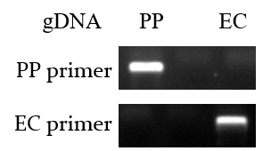
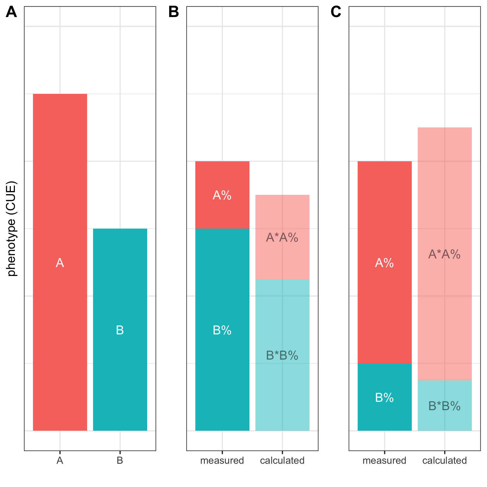
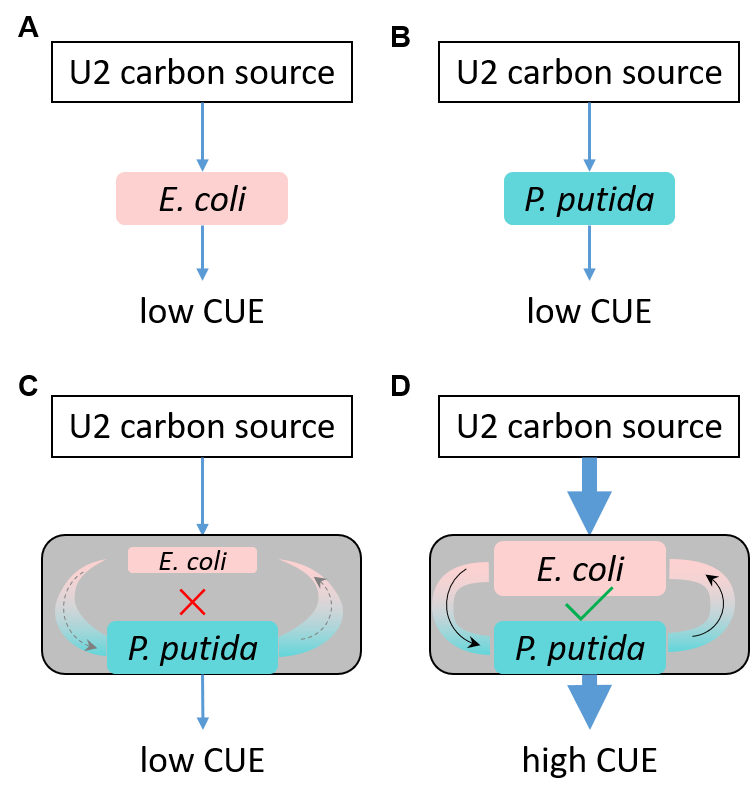

```{r setup, include=FALSE}
knitr::opts_chunk$set(
  fig.width = 8,
  fig.asp=0.618,
  message = F,
  dpi = 300,
  collapse = TRUE,
  comment = "#>",
  fig.path = "figures/Figure-",
  fig.align = "center",
  out.width = "70%"
)
```

# Load packages

```{r packages}
library(tidyverse)
library(cowplot)
library(ggpubr)
library(pheatmap)
library(RColorBrewer)
library(vegan)
library(reshape2)
library(magrittr)

theme_set(theme_bw())
```

To enable reproducible study, we provided the raw-data and source codes for analysis and generating figures. Figures 1-6 and Figures S2-S4 were generated by the following R codes.

# Data processing

Raw data were stored in the `data` folder. It mainly comes from two experiments: one is the BIOLOG standard assay with eco-plate, and the other is the species-specific qPCR assasy. The raw data is provided as in formatted form.


```{r}
biolog <- read_csv("data/biolog.csv")
qPCR_data <- read_csv(file="data/qPCR.csv")
mono_data <- read_csv("data/mono.csv")
head(biolog)
head(qPCR_data)
head(mono_data)
```

The columns are:

- `ratio0`: initial ratio, indicating the name of cultures. "none", "less", "equal", "more", "all" represent the *P. putida* monoculture, 1:1000 (EC/PP, same below), 1:1, 1000:1 cocultrues and and *E. coli* monoculture, respectively.
- `plate`: experiment replicates.
- `A590`: the absorbtance in 590 nm, as reported by BIOLOG workstation.
- `A750`: the absorbtance in 750 nm, as reported by BIOLOG workstation, a measurment of **carbon usage efficiency (CUE)** in this study.
- `carbon_id`: the id of carbon sources. From 1-72, in which 1 is the negative control. The following variable `carbon_name` shows the name of each carbon sources.
- `EC`: the quantity of *E. coli* in coculture
- `PP`: the quantity of *P. putida* in coculture


```{r}
carbon_name <- read_csv("data/carbon.csv")
head(carbon_name)
```

The *E. coli* and *P. putida* qPCR primers were specific (see [Figure S1](#fig-primer-specificity)).

<a id="fig-primer-specificity"></a>
```{r fig-primer-specificity,fig.cap="Figure S1. Specificity of species-specific primers. The PCR experiments were performed with E. coli (EC) and P. putida (PP) specific primers and their genomic DNA, respectively. ",echo=FALSE,fig.width=4}

```


## Raw data

qpcr quantification

```{r}
mono_data <- mono_data  %>% melt(id.vars=c("plate","carbon_id"),variable.name ="Target.Name",value.name="Quantity_mono")

cocu_data <-qPCR_data %>% select(plate,carbon_id,ratio0,EC,PP) %>% melt(id.vars=c("plate","carbon_id","ratio0"),variable.name ="Target.Name",value.name="Quantity_cocu")

data_all <- merge(mono_data, cocu_data, by = c("carbon_id","Target.Name","plate"),all=T) %>% filter(carbon_id!="1")

```


`A750` was normalized by substrating the value of negative control in each plate.

```{r}
qPCR_data <- qPCR_data %>%
   mutate(ratio0 = factor(ratio0, levels = c("less","equal","more")))

# Normalization
biolog_24h <- biolog %>% 
  mutate(ratio0 = factor(ratio0, levels = c("none","less","equal","more","all"))) %>%
  group_by(plate,ratio0) %>% 
  mutate(A590=A590-A590[carbon_id==1],A750=A750-A750[carbon_id==1]) %>%   # set negative control to zero
  filter(carbon_id!=1) %>%
  ungroup()
biolog_mono_24h <- biolog_24h %>% 
  filter(ratio0 %in% c("none","all")) %>% 
  mutate(species=factor(ratio0,levels = c("all","none"),labels = c("E. coli","P. putida"))) %>% 
  dplyr::select(-ratio0)
biolog_coculture_24h <- biolog_24h %>% 
  filter(ratio0 %in% c("less","equal","more")) %>%
  mutate(ratio0 = factor(ratio0, levels = c("less","equal","more")))
```


## Carbon sources used in this study 

71 different carbon sources were used in this study. We firstly need to group or cluster them into different sub-groups. In this study, we used two ways in doing this.

### Clustering of carbon sources

Firstly, carbon sources were clustered by the `A750` in all the cultures. This is what we called "usage group". Three usage groups were generated using `hclust()` method in R, and were named as `U1`, `U2` and `U3`.


```{r defining_carbon_usage}
M_A750_24h <- biolog_24h %>% mutate(sample=paste(ratio0,plate,sep="-")) %>%
  dplyr::select(sample,carbon_id,A750) %>%
  spread(key=sample,value=A750) %>%
  as.data.frame() %>%
  tibble::column_to_rownames(var="carbon_id")
k3 <- cutree(hclust(dist(M_A750_24h)),k=3)
carbon_group <-  data.frame(usage=k3) %>%
  rownames_to_column(var="carbon_id") %>%
  mutate(carbon_id=as.numeric(carbon_id)) %>%
  mutate(usage=paste("U",usage,sep=""))

carbon_name <- left_join(carbon_name, carbon_group)

```


### Defining the carbon preference

Secondly, carbon preferences were determined by comparing the `A750` values between *E. coli* and *P. putida* monocultures. 


```{r defining_carbon_prefer}
biolog_mono_A750_24h <- biolog_mono_24h %>% 
  dplyr::select(plate,carbon_id,species,A750) %>% 
  spread(species,A750) 

PP_prefered <- biolog_mono_A750_24h %>% 
  group_by(carbon_id) %>%  
  summarise(p=t.test(`P. putida`,`E. coli`,alternative = "greater")$p.value) %>% 
  filter(p<0.05)
EC_prefered <- biolog_mono_A750_24h %>% 
  group_by(carbon_id) %>%  
  summarise(p=t.test(`P. putida`,`E. coli`,alternative = "less")$p.value) %>% 
  filter(p<0.05)

carbon_prefer <- data.frame("carbon_id"=carbon_name$carbon_id,
                            "prefer"="none",
                            stringsAsFactors = F)
carbon_prefer[carbon_prefer$carbon_id %in% EC_prefered$carbon_id,"prefer"] <- "EC"
carbon_prefer[carbon_prefer$carbon_id %in% PP_prefered$carbon_id,"prefer"] <- "PP"

carbon_name <- left_join(carbon_name, carbon_prefer)
```

In *E. coli* preferred carbon sources, the CUE of *E. coli* is statistically greater than that of *P. putida*, while in *P. putida* preferred carbon sources, the CUE of *P. putida* is statistically greater than that of *E. coli*.

See [below](#fig3) for more information.


### Summary of carbon sources {#table1}

Table S1 listed all the 71 carbon sources used in this study.

```{r table-S1,fig.cap="Table S1. The list of 71 carbon sources used in this study"}
carbon_name %>% 
  left_join(carbon_prefer) %>% 
  DT::datatable(rownames = FALSE)
```


## Defining social interactions {#fig1}


The social interaction model was shown in [Figure 1](#fig1).


```{r include=FALSE}
fig_cap_interaction_model <- "Figure 1. The interaction model used in this study. (A) The phenotype (CUE) of strain A and strain B in monoculture are CUE_A_ and CUEB, respectively. The CUE of two strains in coculture is assumed not equal, and CUEA is higher than CUEB. (B) When strain A and B were co-cultivated, coculture CUE may fail into three aspects. Firstly, if CUE > CUEA, it was interpreted as positive interaction mode (induction) because of the coculture increased total capacity comparing with the best of monoculture. By contrast, if CUE < CUEB, it was interpreted as negative interaction mode (reduction). Besides, if CUE is between CUEA and CUEB, an additional hypothesis test method was applied to reveal interaction mode as described in Methods (C and D). (C) shows an example of positive interaction. The measured coculture CUE has a normal distribution with the mean of μ1, and the relative abundance of strain A and strain B are A% and B%, respectively. Using the monoculture CUEA and CUEB, and their relative abundance, we can get the calculated CUE, which also has a normal distribution with the mean of μ2. If μ1 is significantly greater than μ2, we defined the coculture with a positive mode of interaction. (D) shows an example of negative interaction. Although the measured coculture CUE is equal to that in (C), we get a negative interaction mode as they have different relative abundance of strain A and B. "
```


```{r fig1, fig.cap=fig_cap_interaction_model,echo=F}

```


According to this model, we then get the social interaction mode of each culture under a specific carbon source and initial ratio.

```{r fig.width=6}
ratio1 <- qPCR_data %>% filter(ratio0 %in% c("less","equal","more")) %>%
  complete(ratio0,carbon_id,plate) %>% 
  group_by(ratio0,carbon_id) %>% 
  dplyr::select(ratio0,plate,carbon_id,ratio1) %>% 
  mutate(ratio1_mean=mean(ratio1,na.rm = T)) %>% 
  mutate(ratio1=ifelse(is.na(ratio1),ratio1_mean,ratio1)) %>% 
  dplyr::select(-ratio1_mean)

mono_A750 <- biolog_mono_24h %>% 
  group_by(carbon_id,species) %>% 
  summarise(A750=mean(A750)) %>% 
  spread(key="species",value="A750") 

A750_caculated <- left_join(ratio1,mono_A750) %>% mutate(A750_cac=(`P. putida`+ratio1*`E. coli`)/(1+ratio1))

social <- biolog_coculture_24h %>% dplyr::select(plate,carbon_id,ratio0,A750) %>%
  left_join(A750_caculated) %>%
  group_by(carbon_id,ratio0) %>% 
  mutate(p_pos=t.test(x=A750,y=A750_cac,alternative = "greater")$p.value,
            p_neg=t.test(x=A750,y=A750_cac,alternative = "less")$p.value) %>%
  mutate(social_type=ifelse(
    p_pos<0.05,"+",
    ifelse(p_neg<0.05,"-","unresolved"))
    ) %>% 
  # mutate(social_type=ifelse(social_type=="+" & (mean(A750)>max(mean(`E. coli`),mean(`P. putida`))),"++",social_type)) %>%
  # mutate(social_type=ifelse(social_type=="-" & (mean(A750)<min(mean(`E. coli`),mean(`P. putida`))),"--",social_type)) %>%
  ungroup() %>%
  dplyr::select(carbon_id,ratio0,social_type,p_pos,p_neg) %>%
  unique() %>%
  mutate(ratio0=factor(ratio0,levels = c("less","equal","more")))

table(social$social_type) %>% barplot(col=c("blue","red","grey"))
```


Finally, we get 87 negative, 46 positive and 80 unresolved interaction modes.

Social interaction defined based on the absolute density of monoculture and co-culture of two species. 

```{r fig.width=6}

social_qpcr <- data_all %>% 
  group_by(carbon_id,Target.Name,ratio0) %>% 
  summarise(p_pos=t.test(x=log10(Quantity_cocu),y=log10(Quantity_mono),alternative = "greater")$p.value,
            p_neg=t.test(x=log10(Quantity_cocu),y=log10(Quantity_mono),alternative = "less")$p.value)%>%
  mutate(social_type=ifelse(
    p_pos<0.05,"+",
    ifelse(p_neg<0.05,"-","unresolved"))
    ) %>% ungroup() %>%
  mutate(ratio0=factor(ratio0,levels = c("less","equal","more")))

table(social_qpcr$social_type) %>% barplot(col=c("blue","red","grey"))

```


## Exploration of data

We now have multiple parameters, including the initial ratio (`ratio0`) and the final ratio (`ratio1`), the populations of *E. coli* and *P. putida* in cocultures (`EC` and `PP`), the CUE (`A750`), the preference of carbon sources to *E. coli* and *P. putida*, and the social interaction mode (`social_type`) calculated as described in [Figure 1](#fig1).

We merged all these data into on date frame in R, and run statistical analysis as follows.

```{r}
merged <- left_join(biolog_coculture_24h,qPCR_data) %>% 
  left_join(social) %>% 
  left_join(carbon_name) %>%
  filter(!is.na(ratio1))

```

Total data containing social behavior based on absolute density definition

```{r}

social_qpcr <-social_qpcr %>% select(social_type,carbon_id,ratio0)
  
merged_qpcr <- qPCR_data %>% 
  left_join(social_qpcr) %>% 
  left_join(carbon_name) %>%
  filter(!is.na(ratio1)) %>% mutate(social_type=factor(social_type,levels = c('unresolved','+','-'))) %>% mutate(prefer=factor(prefer,levels = c('none','EC','PP')))

```

### Data Normalization {#data-normalization}

A prerequisite for running several analysis needs a normal distribution of data, therefore, We explored the normality of observed data in merged data. Accroding to the skewness of data value, we transformed the original data with selected methods. After normalization, it can be seen that all key variables approximately fit the normal distributions.


```{r data-normalization, fig.width=10,message=FALSE,out.width="95%"}
merged <- merged %>% filter(ratio0 %in% c("less","equal","more"))

par(mfrow=c(3,4))


hist(merged$EC)
qqnorm(merged$EC)
hist(log10(merged$EC))
qqnorm(log10(merged$EC))

hist(merged$PP)
qqnorm(merged$PP)
hist(log10(merged$PP))
qqnorm(log10(merged$PP))

hist(merged$ratio1)
qqnorm(merged$ratio1)
hist(log10(merged$ratio1))
qqnorm(log10(merged$ratio1))


```

Therefore, we applied log transformation to the quantity of *E. coli* (EC) and *P. putida* (PP), and sqrt root transformation to A750 values.

```{r}
merged <- merged  %>%
  # mutate_at(c("A750"),sqrt) %>%
  mutate_at(c("EC","PP","ratio1"),log10)
```


Furthermore, the reference of group variables were optimized. For example, the initial ratio base level was set to "`equal`", i.e. `1:1` of *E. coli* and *P. putida*. The base level for `social_type` is "`unresolved`", the base level of `usage` is "`U1`", and the base level of `prefer` is "`none`".

```{r}
merged$ratio0 <- relevel(merged$ratio0,"equal")

merged$social_type <- as_factor(merged$social_type)
merged$social_type <- relevel(merged$social_type,"unresolved")

merged$usage <- as_factor(merged$usage)
merged$usage <- relevel(merged$usage, "U1")

merged$prefer <- as_factor(merged$prefer)
merged$prefer <- relevel(merged$prefer,"none")

```


### Correlation of CUE, cell quantity and final ratio


The following diagram shows the correlation of three dependent values, which are the CUE (`A750`), the quantity of *E. coli* (`EC`) and *P. putida* (`PP`), and the final ratio (`ratio1`). **CUE is more associated with the quantity of _P. putida_ than the quantity of _E. coli_**, although both associations are significant. In addition, final ratio is positively associated with *E. coli* quantity and negatively associated with *P. putida* quantity. Besides, the association between *E. coli* and *P. putida* is exist as well.

```{r fig.width=4,fig.asp=1}
library(corrplot)
mat <- merged[c("A750","EC","PP","ratio1")]
res <- cor.mtest(mat, conf.level=0.95)
cor <- cor(mat)
corrplot(cor, type = "upper", sig.level = c(.001, .01, .05), pch.cex = .9, insig = "label_sig",
         p.mat = res$p, 
         addCoef.col = "grey80",
         diag = FALSE)
```


### Multiple linear regression


We used multiple linear regression to explore the correlations between input and output variables. The input variables include the inital ratio (`ratio0`), carbon sources, which are further clustered by carbon preference (`prefer`) or usage (`usage`). The output variables include the CUE (`A750`), bacteria quantities of *E. coli* (`EC`) and *P. putida* (`PP`), and the social interaction mode (`social_type`). 


```{r}
data <- merged[,c("ratio0","usage","prefer","A750","EC","PP","ratio1","social_type")]
```

First of all, the carbon usage efficiency (CUE, i.e. A750) was regressed with initial ratio, carbon usage group, carbon preference. The regression model results showed that 65% of the dependent variable variation can be explained based on adjusted R-squared (0.6483, p < 2.2e-16). **The factors which significantly influence CUE (A750) are, from strong to weak, carbon usage group (as compared with U1 carbon sources), interaction type (social_type+, as compared with unresolved interaction mode), carbon preference (as compared with non-preferred carbon sources), and initial ratio (ratio0, as compared with the 1:1 coculture)**. Besides, when the other parameters were controlled, either increasing the initial ratio from 1:1 to 1000:1 or decreasing the initial ratio from 1:1 to 1:1000, will significantly lower CUE. Summary of the linear model was showed as follows. 


```{r}
model <- lm(A750~ ratio0 + usage + prefer, data = data)
summary(model)
# car::vif(model)
```

Secondly, the relationship between the final ratio (`ratio1`) and input variables was investigated. This model explains 60% variances of input variables (adjusted R-squared = 0.60, p-value < 2.2e-16). And it shows the final ratio is significantly correlated with all the variables. While other parameters are controlled, **growing in *E. coli* prefered carbon source (`preferEC`) is the most important positive influence fator to final ratio, followed by usage U2 (`usageU2`)**. By contrast, `usageU3`, and `preferPP`, `ratio0less` and `ratio0more` are, from strong to weak, the negative influence fators to final ratio.

```{r}
model <- lm(ratio1 ~ ratio0 + usage + prefer, data = data)
summary(model)
# car::vif(model)
```


Likewise, the relationship between the population of *P. putida* (or *E. coli*) and input variables was investigated. 

As shown below, this model explains 59% of the input variable variations (R-squared = 0.59, p < 2.2e-16). And we found the population of *P. putida* in cocultures is, from strong to weak, significantly associated carbon sources and the initial ratio. Notably, carbon usage groups exhibits stronger influence to CUE than perference. Interestingly, **more *E. coli* in initial inoculate (more, 1000:1) is helpful to increase the final population of *P. putida* compared the 1:1 initial ratio when other parameters were controlled**. By contrast, **less *E. coli* in initial inoculate (less, 1:1000) will decrease the final population of *P. putida* compared the 1:1 initial ratio when other parameters were controlled**


```{r}
model <- lm(PP~ ratio0 + usage + prefer, data = data)
summary(model)
```

This model explains 64% of the input variable variations (R-squared = 0.64, p < 2.2e-16). We found that the population of *E. coli* is negatively correlated with initial ratio, while positively correlated with carbon usage group U2 (usageU2), preferred carbon sources (preferEC). **These results indicated that niche condition is the major challenge to the *E. coli* population**.

```{r}
model <- lm(EC~ ratio0 + usage + prefer, data = data)
summary(model)
```

Finally, we used multinomial logistic regression to study the influence factors to social interaction. 

```{r}
model <- nnet::multinom(social_type ~ ratio0 + usage + prefer, data = data)
summary(model)
```

While comparing positive interaction with unresolved interaction, we get a model of:

$ln(+/unresolved)= -0.26 - 3.20 * ratio0less - 1.25 * ratio0more + 2.42 * usageU2 - 1.31 * usageU3 + 2.12 * preferEC + 0.49 * preferPP$

Of all the input variables, `usageU2` (comparing with `usageU1`) and `preferEC` (comparing with `prefernone`) exhibit the greatest influence to positive interaction, and both are significant (see below).

While comparing negative interaction with unresolved interaction, we get a model of:

$ln(-/unresolved) = 0.48 + 0.78 * ratio0less - 1.14 * ratio0more - 1.40 * usageU2 - 0.06 * usageU3 - 0.06 * preferEC - 0.68 * preferPP$

From this model, we learn that `ratio0less` (comparing with `ratio0equal`) is the most important influence factor to negative interaction. Other significant factors are `ratio0more`, `usageU2` and `preferPP` (see below).

```{r}
rstatix::tidy(model) %>% 
  mutate(sig = cut(p.value, breaks = c(0,0.001,0.01,0.05,1),labels = c("***","**", "*", ""), include.lowest = TRUE)) %>%
  mutate_at(c("estimate","std.error","statistic"), round, digits = 3) %>%
  mutate_at("p.value", formatC, format = "e", digits = 1) %>%
  DT::datatable(options = list(pageLength=7))
```


# Final ratios of cocultures {#final-ratio}

We used ANOVA tests to reveal the variance of final ratios of three cocultures in every carbon source. Since multiple comparisons were included, the p-values were adjusted using "BH" method.

```{r}
aov_p <- compare_means(ratio1 ~ ratio0,
                       group.by = "carbon_id",
                       data=merged,
                       method = "anova",
                       p.adjust.method = "BH") %>% 
  arrange(p.adj) %>% 
  mutate(p.adj.signif = cut(p.adj,breaks = c(0,0.01,0.05,1),labels = c("**","*","ns"))) %>%
  left_join(carbon_prefer)

```


The significances of ANOVA tests were visulized in [Figure 2A](#fig-2A), and five examples of significant and non-significant results were given in [Figure 2B & C](#fig-2B). Besides, all test results for 71 different carbon sources were supplied in [Figure 2S](#all-final-ratio). 

## Figure 2A: density of ANOVA test p-values in final ratios {#fig-2A}

```{r fig.height=1}
p.cutoff <- 0.05
p1 <- ggplot(aov_p,aes(p.adj)) + 
  # geom_histogram(bins=30) + 
  geom_line(stat = "density",lwd=1) +
  geom_density(lwd=0,color=NA,fill="lightblue") +
  geom_vline(xintercept = p.cutoff,lwd=1,lty="dashed",color="firebrick") +
  geom_text(x=0.06,y=0,label=p.cutoff,
            vjust="top",
            hjust="left",
            color="firebrick")

p2 <- ggplot(aov_p, aes(p.adj.signif,fill=prefer)) + geom_bar() +
  labs(x="significance of p.adj",y="frequency") + 
  # geom_text(aes(label=Freq),vjust=0,nudge_y = 1) +
  scale_fill_discrete(breaks=c("none","EC","PP"),labels=c("none","E. coli","P. putida"),name="Preference") +
  theme(legend.text = element_text(face="italic"),
        legend.position = c(0.65,0.7))


library(grid)
vp <- viewport(width=0.3,height=0.6,x=0.7,y=0.5)
pushViewport(vp)
```


```{r fig.width=7,fig.asp=0.618,fig.cap="Figure 2A. The density of adjusted p-value (ANOVA) in testing whether final ratios of three coculture are different in all carbon sources. X-axis represents the adjusted p-value, and vertical line indicates the position of p-value cutoff (0.05). inset: barplot shows the frequency of significance of adjusted p-value (**, p<0.01, *, p<0.05, ns, p≥0.05). In the barplot, frequencies were colored by carbon preference."}
print(p1)
print(p2,vp=vp)
# ggsave("figure 2A.tiff",path="figures")


```


## Figure 2B, C: examples of significant/non-significant results {#fig-2B}

```{r echo=FALSE}
fig_cap_ratio1_in_selected_carbon <- "Figure 2B,C. Final ratios of cocultures. Examples for significant results (B) or non-significant results (C) of final ratios. The strip label of each subplot (top) indicates carbon source."
```


```{r fig.asp=0.9,fig.width=6,fig.cap=fig_cap_ratio1_in_selected_carbon}
merged$ratio0 <- relevel(merged$ratio0, "less")

carbon_name_labeller <- function(x){
  name_of <- carbon_name$carbon_source
  names(name_of) <- carbon_name$carbon_id
  return(as.character(name_of[x]))
}
selected_significant_carbon_id <- c(29,32,36,39,46)
selected_nonsignificant_carbon_id <- c(3,4,12,15,53)
p1 <- ggplot(
  data=filter(merged,carbon_id %in% selected_significant_carbon_id) %>%
    left_join(aov_p), 
  mapping = aes(ratio0,ratio1,color=prefer)) 
p2 <- ggplot(
  data=filter(merged,carbon_id %in% selected_nonsignificant_carbon_id) %>%
    left_join(aov_p),
  mapping = aes(ratio0,ratio1,color=prefer)) 


plots <- lapply(list(p1,p2),function(x){
  x + geom_boxplot() + geom_jitter() +
    geom_text(aes(x="equal", y=0.15,label= paste("p.adj=",p.adj,sep = "")),check_overlap = T,size=3,show.legend = FALSE) +
    geom_text(aes(x="less",y=.65,label=carbon_id),color="grey",size=3) +
    facet_wrap(~carbon_id,
               ncol=5,
               labeller = labeller(carbon_id=carbon_name_labeller)) + 
    # stat_compare_means(method="aov") + 
    scale_x_discrete(breaks=c("less","equal","more"),labels=c("1:1000","1:1","1000:1")) +
    theme(axis.text.x = element_text(angle = 60, hjust = 1,vjust = 1)) +
    scale_color_discrete(breaks=c("none","EC","PP"),labels=c("none","E. coli","P. putida"),name="Preference")+
    theme(legend.text = element_text(face="italic")) +
    labs(x="",y="final ratio (EC/PP)")
    
})


plot_grid(plotlist = plots,ncol=1,labels=c("B","C"))
# ggsave("figure 2.tiff",path="figures")


```


## Figure S2: Final ratios of all cultures {#all-final-ratio}

The whole picture of final ratios. 

```{r fig.asp=1,fig.width=8}
ggplot(merged %>% left_join(aov_p),aes(ratio0,ratio1,color=prefer)) + geom_boxplot() +
  geom_text(aes(x="less",y=1,label=paste0(carbon_id,"(p=",p.adj,")")),color="grey",vjust="inward",hjust="inward",size=3,show.legend = F) +
  # ggpubr::stat_compare_means(method="aov",label="p.signif") +
  facet_wrap(~carbon_id) +
  # geom_jitter() +
  # geom_text(aes(x="equal", y=0.5,label= p.adj),check_overlap = T, data=aov_p,inherit.aes = FALSE,size=3) +
  # scale_y_log10(breaks=c(0.001,0.01,0.1,1,10),labels=c("0.001","0.01","0.1","1","10")) +
  xlab("") + ylab("final ratio (EC/PP)") +
    scale_x_discrete(breaks=c("less","equal","more"),labels=c("1:1000","1:1","1000:1")) +
    theme(axis.text.x = element_text(angle = 60, hjust = 1,vjust = 1)) +
    scale_color_discrete(breaks=c("none","EC","PP"),labels=c("none","E. coli","P. putida"),name="Preference")+
    theme(legend.text = element_text(face="italic")) +
  theme(axis.text.x = element_text(angle = 90,hjust = 1,vjust = 0.5),
      legend.position = "top",
      legend.direction = "horizontal",
      strip.background = element_blank(),  # remove facet label - "strip"
      strip.text = element_blank())
# ggsave("figure S2.tiff",path="figures")
# export::graph2ppt(file="figures.pptx",append=TRUE)

```


# Figure 3. carbon preferences overcome initial ratios {#fig3}


```{r}
plots <- lapply(c("EC","PP"),function(x){
  d <- biolog_mono_24h %>% 
    left_join(carbon_name) %>%
    filter(prefer == x)
  ggplot(d,aes(carbon_source,A750,fill=species)) + 
    geom_boxplot() +
    labs(y="CUE",x="") +
    # coord_flip() +
    theme(legend.position = c(0.5,0.8),
          legend.direction = "horizontal",
          legend.text = element_text(face = "italic"),
          legend.title = element_blank(),
          axis.text.x = element_text(angle = 60, hjust = 1,vjust = 1))
    
    
  
})


```


```{r}
ratio0_labeller <- function(x){
  name_of_ratio0 <- c("P. putida","1:1000","1:1","1000:1","E. coli")
  names(name_of_ratio0) <- c("none","less","equal","more","all")
  return(as.character(name_of_ratio0[x]))
}

p1 <- ggplot(merged,aes(x=prefer,y=ratio1)) + 
  geom_boxplot() + 
  facet_wrap(~ratio0,
             labeller = labeller(ratio0 = ratio0_labeller)) + 
  scale_x_discrete(breaks=c("none","EC","PP"),labels=c("none","E. coli","P. putida")) +
  theme(axis.text.x = element_text(face = "italic",
                                   angle = 60,
                                   hjust = 1,
                                   vjust = 1)) +
  stat_compare_means(method="wilcox.test",comparisons = list(c("EC","none"),c("none","PP"),c("EC","PP")),size=3) +
  labs(x="type of carbon perference", y="final ratio (EC/PP)") +
  ylim(c(NA,1.5))

prefer_labeller <- function(x){
  name_of_prefer <- c("none","E. coli","P. putida")
  names(name_of_prefer) <- c("none","EC","PP")
  return(as.character(name_of_prefer[x]))
}

p2 <- ggplot(merged,aes(x=ratio0,y=ratio1)) + 
  geom_boxplot() + 
  facet_wrap(~prefer, labeller = labeller(prefer = prefer_labeller)) + 
  theme(strip.text = element_text(face = "italic")) +
  stat_compare_means(method="wilcox.test",comparisons = list(c("less","equal"),c("equal","more"),c("less","more")),size=3) +
  scale_x_discrete(breaks=c("less","equal","more"),labels=c("1:1000","1:1","1000:1")) +
    theme(axis.text.x = element_text(angle = 60, hjust = 1,vjust = 1)) +
  labs(x="inital ratio (EC/PP)", y="final ratio (EC/PP)") +
  ylim(c(NA,1.5))
```


```{r,fig.width=8,fig.asp=1, fig.cap="Figure 3. carbon preferences."}
plot_grid(plot_grid(plots[[1]] + ylim(NA,0.3),
                    plots[[2]],
                    labels = "AUTO",
                    rel_widths  = c(1.5,3),
                    ncol = 2,align = "h"),
          plot_grid(p1,p2,labels = c("C","D"),ncol = 2),
          ncol = 1,
          rel_heights = c(5,4))
# ggsave("figure 3.tiff",path="figures")

```


# Initial ratio regulate carbon usage profiles


## Figure S3. Comparison of monocultures and cocultures

```{r coculture_enhance_CUE, fig.width=5,fig.asp=0.618}
p_cue <- ggplot(biolog_24h,aes(ratio0,A750)) + 
  geom_boxplot() +
  # stat_compare_means(ref.group = ".all.",
  #                    label = "p.format",
  #                    method="wilcox.test") +
  geom_hline(aes(yintercept = median(A750)),lty=2,color="firebrick") +
    scale_x_discrete(breaks=c("none","less","equal","more","all"),labels=c("P. putida","1:1000","1:1","1000:1","E. coli")) +
    theme(axis.text.x = element_text(angle = 60, hjust = 1,vjust = 1)) +
  geom_text(aes(ratio0,y,label=y),
            inherit.aes = F, 
            # color="firebrick",
            data = biolog_24h %>% group_by(ratio0) %>% 
              summarise(y=median(A750)),
            vjust=-0.3) +
  labs(x="initial ratio (EC/PP)",y="CUE")
```


```{r}
# add confidential levels in PCA 
add_ellipase <- function(p, x="PC1", y="PC2", group="group",
                         ellipase_pro = 0.95,
                         linetype="dashed",
                         colour = "black",
                         lwd = 1,...){
  obs <- p$data[,c(x,y,group)]
  colnames(obs) <- c("x", "y", "group")
  ellipse_pro <- ellipase_pro
  theta <- c(seq(-pi, pi, length = 50), seq(pi, -pi, length = 50))
  circle <- cbind(cos(theta), sin(theta))
  ell <- plyr::ddply(obs, 'group', function(x) {
    if(nrow(x) <= 2) {
      return(NULL)
    }
    sigma <- var(cbind(x$x, x$y))
    mu <- c(mean(x$x), mean(x$y))
    ed <- sqrt(qchisq(ellipse_pro, df = 2))
    data.frame(sweep(circle %*% chol(sigma) * ed, 2, mu, FUN = '+'))
    })
  names(ell)[2:3] <- c('x', 'y')
  
  ell <- plyr::ddply(ell, plyr::.(group) , function(x) x[chull(x$x, x$y), ])
  p <- p + geom_polygon(data = ell, 
                        aes(x=x,y=y,group = group), 
                        colour = colour,
                        linetype=linetype,
                        lwd =lwd,
                        inherit.aes = F,
                        ...)
  return(p)
}
```

```{r fig.width=5}
library(vegan)
pca <- rda(t(M_A750_24h))
percent_var <- pca$CA$eig/pca$tot.chi
df <- scores(pca)$sites  %>%
  as.data.frame() %>%
  tibble::rownames_to_column(var="sample") %>%
  separate(sample,c("ratio0","rep"),sep="-",remove = F)
df$ratio0 <- factor(df$ratio0, levels = c("none","less","equal","more","all"),labels = c("P. putida","1:1000","1:1","1000:1","E. coli"))
group <- cutree(hclust(dist(t(M_A750_24h))),k=3)
clustered_group <- as.data.frame(group) %>% tibble::rownames_to_column(var = "sample")
df %<>% left_join(clustered_group) 
p <- ggplot(df, aes(PC1,PC2,label=ratio0,color=ratio0))+
  geom_point(size=3,show.legend = F) +
  scale_color_manual(values = brewer.pal(9,"YlOrRd")[5:9],name="Initial Ratio")+
  xlab(paste0("PC1: ", round(percent_var[1] * 100), "% variance")) +
  ylab(paste0("PC2: ", round(percent_var[2] * 100), "% variance")) +
  directlabels::geom_dl(method="smart.grid",size=3)

p_pca <- add_ellipase(p,alpha=0.1,show.legend = F,lwd=1)

```


```{r fig.width=8,fig.cap="Figure S3. The carbon usage profiles of two monocultures (*E.coli* and *P. putida*) and three cocultures (1:1000, 1:1, and 1000:1).  (A) boxplot. Number shows the median of each culture, and horizontal line shows the mean of all cultures. (B) PCA analysis of carbon usage profiles. Ellipses represent the 95% confidence interval of clustering."}
plot_grid(p_cue,p_pca,ncol = 2,labels = c("A","B"),rel_widths = c(7,10))
# ggsave("figure 4.tiff",path="figures")


```


## Figure 4: Initial ratio affects the CUE of cocultures


```{r}
anno_carbon_group <- carbon_group %>% 
  left_join(carbon_prefer) %>%
  column_to_rownames(var="carbon_id")
colnames(M_A750_24h) <- rep(c("E. coli","1:1","1:1000","1000:1","P. putida"),each=3)
p_heatmap <- pheatmap(t(M_A750_24h),
         annotation_col = anno_carbon_group[c(2,1)],
         cutree_cols = 3,
         # cutree_rows = 3,
         fontsize_col = 6,
         silent = T)
```


Figure 5. The CUE (A) and final ratio (B) of cultures with nine U2 carbon sources (from left to right, top to down). 

```{r}
biolog_24h_U2 <- left_join(biolog_24h,carbon_group) %>% filter(usage=="U2") 
hsd_group <- lapply(unique(biolog_24h_U2$carbon_id), function(x){
  m <- aov(A750~ratio0,data=filter(biolog_24h_U2,carbon_id==x))
  library(agricolae)
  g <- HSD.test(m,"ratio0",group=TRUE)$groups
  d <- rownames_to_column(g,var="ratio0")
  d$carbon_id <- x
  return(d[-2])
})
hsd_group <- do.call("rbind",hsd_group)
hsd_group$ratio0 <- factor(hsd_group$ratio0, 
                           levels = c("none","less","equal","more","all"))
# add group on top of boxplot
hsd_group <- biolog_24h_U2 %>% group_by(ratio0,carbon_id) %>% summarize(q3=quantile(A750)[3]) %>% left_join(hsd_group)
```


```{r fig.width=6,fig.asp=0.8}

u2_p1 <- ggplot(biolog_24h_U2, aes(ratio0,A750)) + 
  geom_boxplot() + 
  geom_text(aes(x="none",y=max(A750)*1.1,label=carbon_id),color="grey",vjust=1,size=3,show.legend = F) +
  geom_text(aes(x=ratio0,y=q3,label=groups),show.legend = F,
            data = hsd_group,inherit.aes = F,
            vjust=0,nudge_y = .2,hjust=0) +
  facet_wrap(~carbon_id,ncol=5,
             labeller = labeller(carbon_id=carbon_name_labeller)) +
  scale_x_discrete(breaks=c("none","less","equal","more","all"),labels=c("P.putida","1:1000","1:1","1000:1","E.coli")) +
  scale_y_continuous(breaks = c(0,0.5,1)) +
  labs(x="",y="CUE") + 
  # ggpubr::stat_compare_means(method="aov",label="p.format") +
  theme(axis.text.x = element_text(angle = 45,hjust = 1,vjust = 1),
        legend.position = "top",
        legend.direction = "horizontal"
  )
```


```{r fig4, fig.asp=1,fig.width=8,fig.cap="Figure 4. Initial ratio regulates carbon usage profiles of cocultures. (A) Clustering of carbon sources by usage groups. In the heatmap, type of carbon sources was indicated by bars on the top, carbon id is indicated by the number on the bottom, and experiment replicates were given on the right. Legend colorbar indicates the range of CUE values. (B) The CUE of mono- and cocultures with nine U2 carbon sources (from left to right, top to down). The x-axis indicates culture conditions, and the y-axis indicates CUEs. ANOVA and Tukey multiple comparisons were performed. Text on boxplot indicates whether significant variances were observed between different cultures."}
plot_grid(ggplotify::as.ggplot(p_heatmap),
          u2_p1,
          labels = "AUTO",ncol=1)
# ggsave("figure 5.tiff",path="figures")


```

## Figure S4 The results of CUE for all combinations

Related to figure 4.

```{r fig.asp=1,fig.width=6}
ggplot(biolog_24h, aes(ratio0,A750)) + 
  geom_boxplot() + 
  geom_text(aes(x="less",y=max(A750)*1.1,label=carbon_id),
            color="grey",
            vjust=1,size=3,show.legend = F) +
  facet_wrap(~carbon_id,ncol=9) +    
  scale_x_discrete(breaks=c("none","less","equal","more","all"),labels=c("P. putida","1:1000","1:1","1000:1","E. coli")) +
  scale_y_continuous(breaks = c(0,0.5,1),name = "CUE") +
  theme(axis.text.x = element_text(angle = 90,hjust = 1,vjust = 0.5),
        legend.position = "top",
        legend.direction = "horizontal",
        strip.background = element_blank(),  # remove facet label - "strip"
        strip.text = element_blank())
# ggsave("figure S3.tiff",path="figures")
```


# Initial ratio regulates social interactions


Social interaction mode was calculate as described in [Figure 1](#fig1).

## Figure 5. Social interactions in cocultures

```{r}
# social vs ratio0
plots_proportion <- lapply(list(c("ratio0","social_type"),c("ratio0","usage","social_type"),c("ratio0","prefer","social_type")), function(x){
  df <- merged %>%
    group_by(.dots=x) %>%
    summarise(count=n()) %>%
    mutate(proportion=count/sum(count)) %>%
    mutate(label=paste(round(proportion*100),"%",sep=""))
  ggplot(df,aes_string("ratio0","proportion",fill="social_type")) +
    geom_col() +
    geom_text(aes(label=label),color="white",
              position = position_stack(vjust=0.5),
              size=3) +
    scale_fill_manual(values = c("+"="firebrick","-"="royalblue","unresolved"="grey"),
                      labels = c("unresolved", "positive", "negative"),
                     name="interaction mode") +
   theme(legend.position = "none",
          legend.title = element_text(face="bold")) +  
    scale_x_discrete(breaks=c("less","equal","more"),labels=c("1:1000","1:1","1000:1")) +
  theme(axis.text.x = element_text(angle = 60,hjust = 1,vjust = 1)  ) +
    xlab("") 
})

legend <- get_legend(plots_proportion[[1]] + theme(legend.position = "right"))
```


```{r fig.width=4,fig.asp=0.8}
plots_population <- lapply(c("EC","PP"),function(x){
  ggplot(merged,aes_string("social_type",x)) + geom_boxplot() +
    stat_compare_means(method = "wilcox.test",comparisons = list(c("unresolved","+"),c("-","+")),size=3)+
    theme(axis.text.x = element_text(angle = 60,hjust = 1,vjust = 1)  ) +
    scale_x_discrete(labels = c("unresolved","positive","negative"),
                     breaks = c("unresolved","+","-")) +
    labs(x="")
})

```


```{r social_vs_groups_barplot,fig.width=8,fig.asp=1,fig.cap="Figure 5. Social interactions in cocultures. (A) overall comparison of interaction mode between three cocultures with all carbon sources. The results were, furthermore, summarized into three parts by the carbon usage groups (B) and preference (C), respectively. Comparison of *E. coli* (D) and *P. putida* (E) quantities in different social interaction modes were showed as well. For A-C, the proportions were colored by interaction mode. For D-E , the x-axis indicates interaction mode, and the y-axis indicates the log10 transformed bacteria quantities of *E. coli* and *P. putida*, respectively."}

plot_grid(plot_grid(plots_proportion[[1]],
                    plots_proportion[[2]]+ facet_wrap(~usage ),
                    legend, 
                    rel_widths = c(1.8,4,1.5),
                    ncol = 3,
                    labels = c("A","B","")),
          plot_grid(plots_proportion[[3]] + facet_wrap(~prefer, 
                                                       labeller = labeller(prefer = prefer_labeller)) + 
                      theme(strip.text = element_text(face = "italic")),
                    plots_population[[1]] + labs(y="quantity of E. coli"),
                    plots_population[[2]] + labs(y="quantity of P. putida"),
                    labels = c("C","D","E"),
                    ncol = 3,
                    rel_widths = c(5,2,2)),
          ncol = 1)
# ggsave("figure 5.tiff",path="figures")


```

## Figure  Social interaction defined based on the absolute density of monoculture and  co-culture of two species.

```{r}

plots_proportion <- lapply(list(c("ratio0","social_type"),c("ratio0","usage","social_type"),c("ratio0","prefer","social_type")), function(x){
  df <- merged_qpcr %>%
    group_by(.dots=x) %>%
    summarise(count=n()) %>%
    mutate(proportion=count/sum(count)) %>%
    mutate(label=paste(round(proportion*100),"%",sep=""))
  ggplot(df,aes_string("ratio0","proportion",fill="social_type")) +
    geom_col() +
    geom_text(aes(label=label),color="white",
              position = position_stack(vjust=0.5),
              size=3) +
    scale_fill_manual(values = c("+"="firebrick","-"="royalblue","unresolved"="grey"),
                     labels = c("unresolved", "positive", "negative"),
                     name="interaction mode") +
   theme(legend.position = "none",
          legend.title = element_text(face="bold")) +  
    scale_x_discrete(breaks=c("less","equal","more"),labels=c("1:1000","1:1","1000:1")) +
  theme(axis.text.x = element_text(angle = 60,hjust = 1,vjust = 1)  ) +
    xlab("") 
})

legend <- get_legend(plots_proportion[[1]] + theme(legend.position = "right"))

```

```{r }
plots_population <- lapply(c("EC","PP"),function(x){
  ggplot(merged_qpcr,aes_string("social_type",x)) + geom_boxplot() +
    stat_compare_means(method = "wilcox.test",comparisons = list(c("unresolved","+"),c("-","+")),size=3)+
    theme(axis.text.x = element_text(angle = 60,hjust = 1,vjust = 1)  ) +
    scale_x_discrete(labels = c("unresolved","positive","negative"),
                     breaks = c("unresolved","+","-")) +
    labs(x="")
})


```

```{r fig.width=8,fig.asp=1}
plot_grid(plot_grid(plots_proportion[[1]],
                    plots_proportion[[2]]+ facet_wrap(~usage ),
                    legend, 
                    rel_widths = c(1.8,4,1.5),
                    ncol = 3,
                    labels = c("A","B","")),
          plot_grid(plots_proportion[[3]] + facet_wrap(~prefer, 
                                                       labeller = labeller(prefer = prefer_labeller)) + 
                      theme(strip.text = element_text(face = "italic")),
                    plots_population[[1]] + labs(y="quantity of E. coli"),
                    plots_population[[2]] + labs(y="quantity of P. putida"),
                    labels = c("C","D","E"),
                    ncol = 3,
                    rel_widths = c(5,2,2)),
          ncol = 1)
# ggsave("figure 5-1.tiff",path="figures")


```

## Figure S5 The interaction mode of all combinations

Figure S5 is related to Figure 5.

```{r fig.asp=1.2,fig.width=6, fig.cap="Figure S5 The interaction mode of all combinations."}
left_join(biolog_coculture_24h,social) %>%
  ggplot(aes(ratio0,A750,color=social_type)) + 
    geom_boxplot() + 
    geom_text(aes(x="less",y=max(A750)*1.1,label=carbon_id),vjust=1,color="grey",size=3) +
    facet_wrap(~carbon_id,ncol=9) + 
    scale_color_manual(values = c("+"="firebrick","-"="royalblue","unresolved"="grey"),
                      labels = c("unresolved", "positive", "negative"),
                     name="interaction mode: ") +
    scale_y_continuous(breaks = c(0,0.5,1)) +
    scale_x_discrete(breaks=c("less","equal","more"),labels=c("1:1000","1:1","1000:1")) +
    labs(x="",y="CUE") +
    theme(axis.text.x = element_text(angle = 90,hjust = 1,vjust = 0.5),
          legend.position = "top",
          strip.background = element_blank(),  # remove facet label - "strip"
          strip.text = element_blank())
# ggsave("figure S4.tiff",path="figures")
```


# Figure 6. Metabolic coupling in utilizing U2 carbon sources


```{r echo=FALSE, fig.cap="Figure 6. Metabolic coupling in utilizing U2 carbon sources. The E. coli monoculture (A) and P. putida monoculture (B) only have a little efficiency on utilizing U2 carbon sources. In a coculture which has less E. coli population, metabolic coupling is hardly to setup as E. coli is the bottle neck to restrict the flow of metabolite (C). While E. coli has an equivalent population to P. putida, the metabolic flow can be established, and lead to high CUE for U2 carbon sources (D)."}

```


